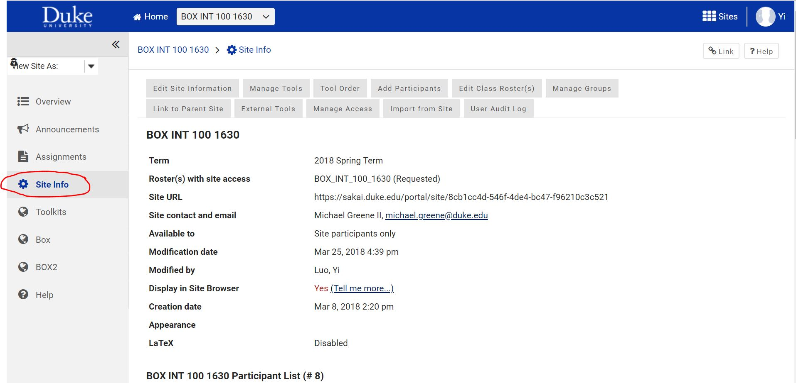
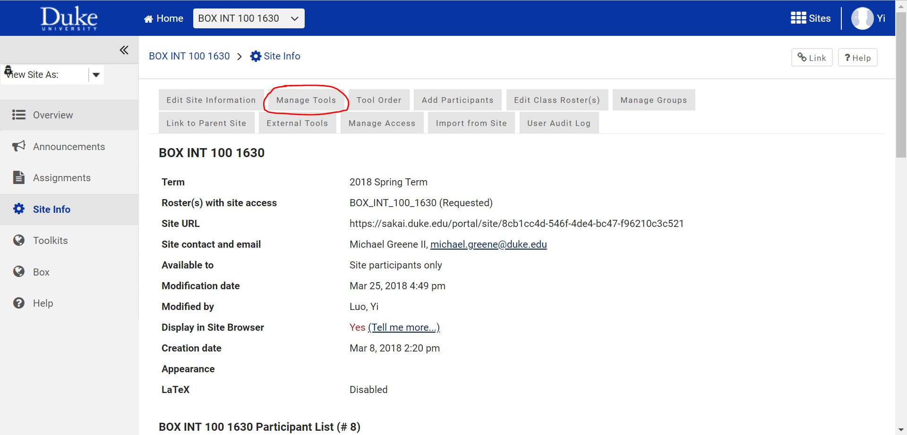
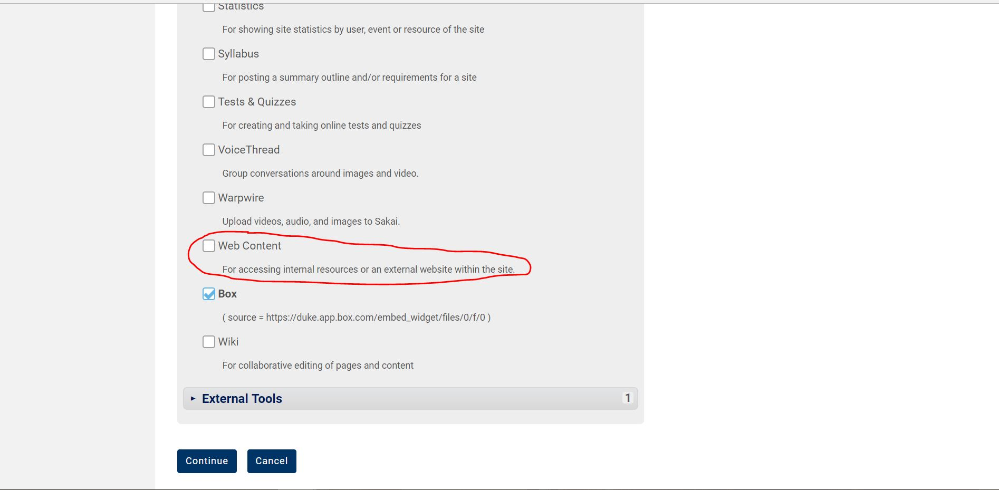
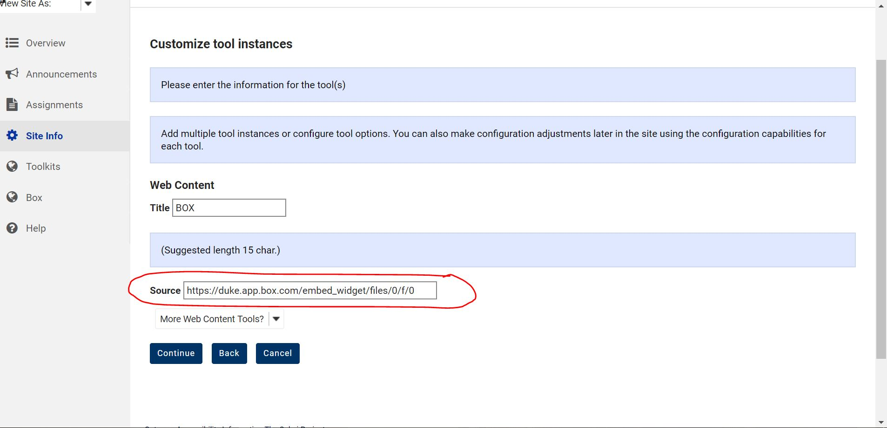
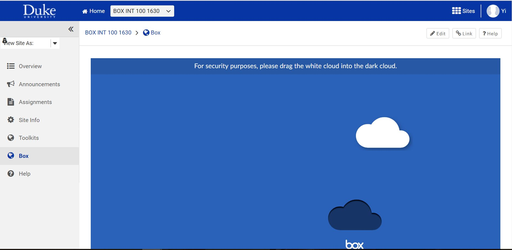

## Embed BOX into Sakai

#### Step 1

Click ``Site Info``

#### Step 2

Click ``Manage Tools``

#### Step 3

Scroll down and find ``Web Content``, check the checkbox and click ``Continue``.

#### Step 4

Enter the URL for embedded BOX and click ``Continue``, then click ``Finish``.

 

#### Step 5

``Box `` icon appears on the list. Click ``Box`` and Box website will be displayed inside Sakai without popping up another webpage.

