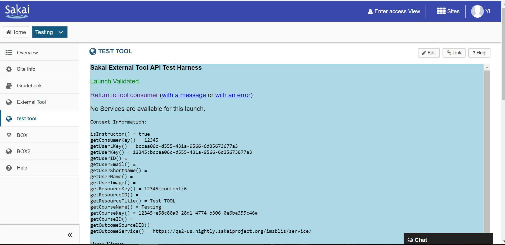
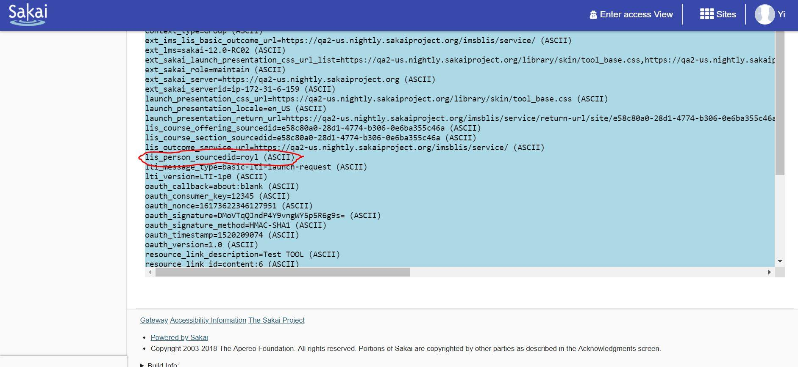
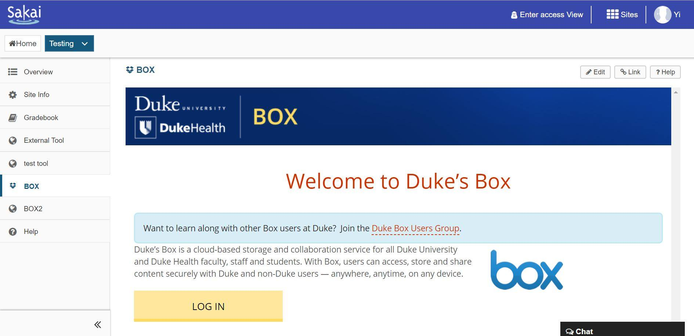

# Readme

## Sprint 1

We worked with Server team and successfully deployed the environment like Apache Tomcat, and MySQL. And compiled the code and started up the server. 

We also tested the LTI integration on the Sakai instance using the Server provided by original Sakai team. This shows the data we sent through LTI, which contains the username LTI automatically sent to Box(or other LTI tools provider).

And successfully add a Box icon on that server. When we click the Box icon, the Box website is shown inside the Sakai just like this:

